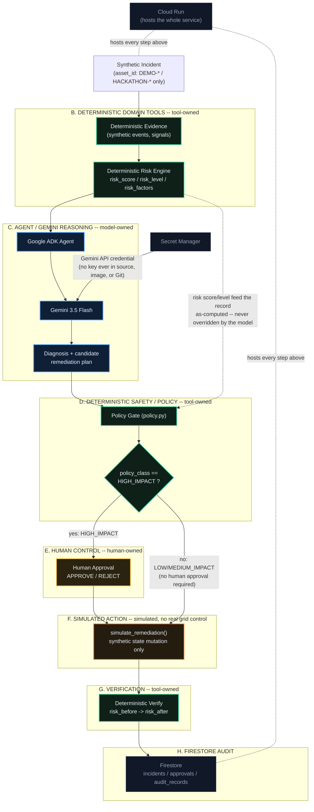

# Architecture

## Core principle

> **AI does not own the truth. Evidence does.**

Every box in the diagram below is labeled with who actually owns the value
it produces. Gemini never sets a risk score, never decides policy, never
grants its own approval, and never executes anything for real. Those four
things are the whole safety design of this system; everything else is
plumbing around them.

## Diagram

## Google Cloud components used

| Component | Role in the pipeline |
|---|---|
| **Cloud Run** | Hosts the FastAPI service end to end -- `/health`, `/api/status`, `/api/incidents/*`, and the judge-facing `/demo` UI. Public, synthetic-demo-only access. |
| **Google ADK** | Runs the agent's tool-calling loop: gives Gemini typed, read-only access to the deterministic evidence tools and one structured-output tool (`propose_incident_analysis`) -- `simulate_remediation` is never in its tool list, so there is no code path for the model to invoke it. |
| **Gemini 3.5 Flash** | Produces the diagnosis and a *candidate* recommended action from the evidence ADK hands it. Nothing it returns is trusted directly -- see Trust boundaries below. |
| **Secret Manager** | Holds the Gemini API key as a narrowly-scoped secret (`ai-raxbar-gemini-api-key`), mounted into Cloud Run as an env var via the runtime service identity. No service-account JSON, no key in source/image/Git. |
| **Firestore** | Durable, Firestore-Native persistence for `incidents`, `approvals`, and `audit_records`, written through the same `IncidentRepository` interface the offline tests exercise against a fake client. |

## Trust boundaries

| Boundary | Owns | Examples | Enforced by |
|---|---|---|---|
| **DETERMINISTIC / TOOL-OWNED** | Ground truth | evidence, risk score/level/factors, policy classification, verification result | `risk_engine.py`, `policy.py`, `tools.py` -- plain, tested, deterministic Python. The model never has write access to any of these fields. |
| **MODEL-OWNED** | Narrative only | diagnosis text, reasoning summary, a *candidate* recommended action | `agent.py` -- the candidate action is validated against real remediation templates before it's trusted; an invalid or hallucinated one is rejected and recorded as an uncertainty, never silently substituted. |
| **HUMAN-OWNED** | The go/no-go decision | approval of a `HIGH_IMPACT` action | `approval.py` + `orchestrator.execute_action` -- a `HIGH_IMPACT` action cannot execute without an explicit `APPROVED` `ApprovalState`; this is checked independently in two places (the orchestrator and `simulate_remediation` itself), so there is no bypass path. |
| **SIMULATED** | The "action" itself | `simulate_remediation()` | Mutates only in-memory synthetic asset signals (e.g. `load_ratio`). No external system, no real grid device, is ever contacted. |

## Why the boundaries are drawn here

Gemini is good at turning noisy synthetic signals into a readable diagnosis
and at proposing a plausible next step -- it is not, and is not trusted to
be, a source of truth for a number that gates a real-world-shaped action.
Every value a safety decision depends on (risk, policy class, verification
outcome) is computed by small, deterministic, unit-tested functions that
exist independently of any model call, so the same incident always yields
the same policy decision regardless of what the model says. Approval is
drawn as a hard, human-only boundary rather than a configurable threshold,
because the one rule this project treats as non-negotiable is that a
`HIGH_IMPACT` action requires a person, not a model, to say yes.
